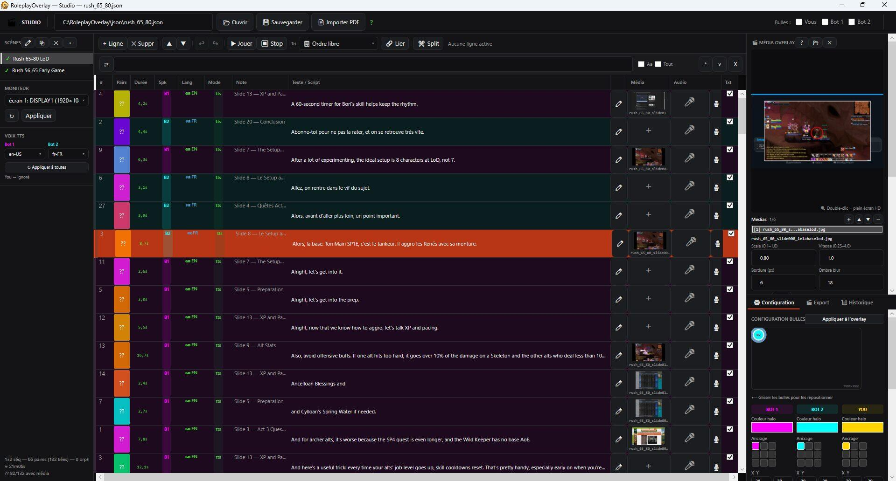
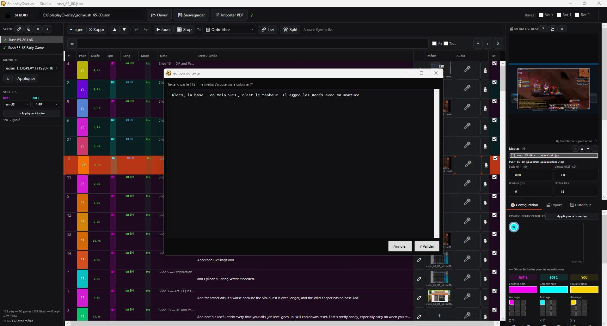
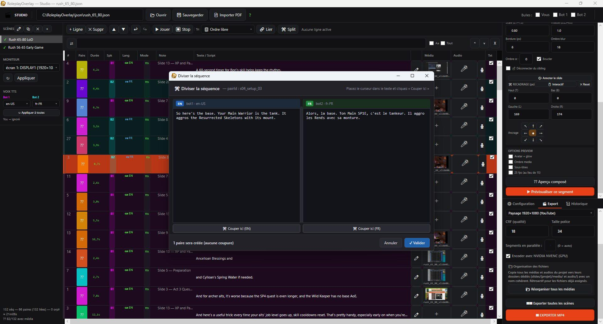
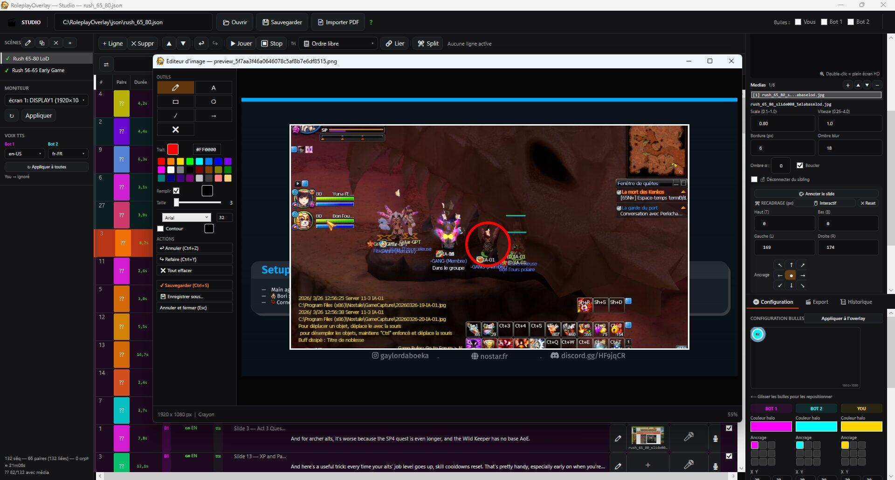
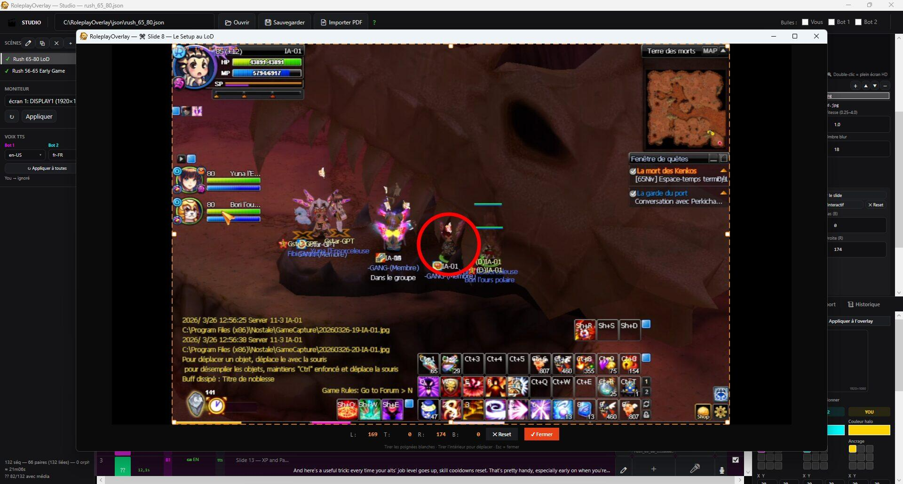
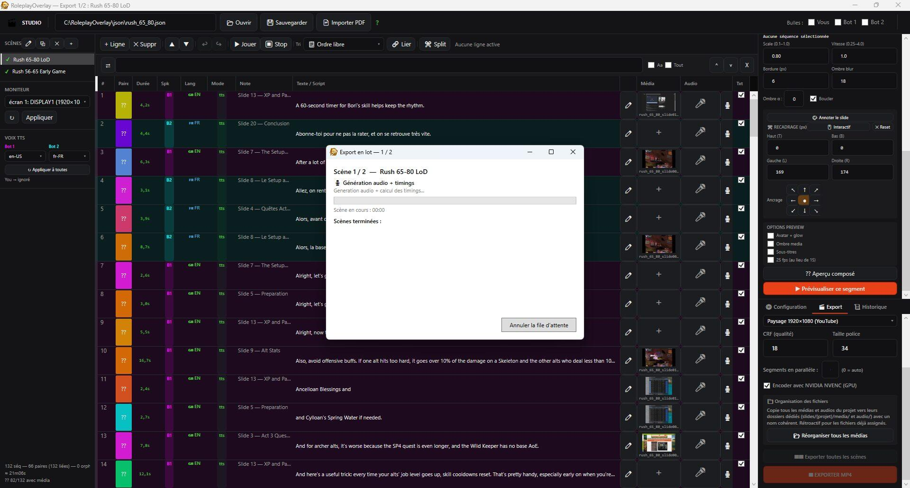

# RoleplayOverlay

> Studio vidéo de bureau qui transforme un script de dialogue bilingue FR/EN en vidéo
> sous-titrée, avec voix de synthèse, médias et avatars. Version logiciel du projet.
> Une version web, utilisable par tout le monde sans rien installer, est en ligne sur
> https://aboeka.fr/projects/roleplay-overlay

---

## C'est quoi

Roleplay Overlay, c'est d'abord un **studio vidéo que je me suis construit pour ma chaîne
gaming** : une appli de bureau (C#/.NET 8, WPF) qui prend un script de dialogue bilingue et en
fait une vidéo sous-titrée, avec voix de synthèse, médias, avatars et chapitres YouTube. Je l'ai
fait grandir épisode après épisode jusqu'à en faire un vrai outil de montage.

Le site aboeka.fr en est le **portage web** : la même idée, rendue utilisable par tout le monde
dans le navigateur, sans rien installer.

---

## Le logiciel en images

| | |
|---|---|
|  **Timeline des répliques** : segment par segment, avec les timings. |  **Édition d'une réplique** : aperçu et réglages de l'overlay à droite. |
|  **Découpe d'une séquence** : les deux versions linguistiques restent alignées. |  **Éditeur d'image intégré** : annotations, cercles et calques sur une capture. |
|  **Rendu overlay annoté** : capture habillée d'un cercle et de textes. |  **Export d'un épisode** : pistes audio et timings avant le rendu final. |

---

## Comment marche le rendu

- **Une réplique, un segment** : chaque réplique devient un court segment vidéo (fond, voix,
  médias, sous-titre). Les segments sont recollés bout à bout, sans réencodage, donc vite.
- **Sous-titres gravés (ASS)** : le texte est découpé proprement (par ponctuation, sans mot
  orphelin) puis gravé dans l'image, coloré par locuteur. Pas de fichier de sous-titres séparé.
- **Composition de l'image** : FFmpeg empile les couches (fond, médias ou mosaïque de 2 à 6
  cellules, avatar à halo du locuteur, puis les sous-titres par-dessus).
- **Voix et minutage** : la voix (Azure, Piper, ou un enregistrement) donne la durée réelle de
  chaque réplique, et c'est elle qui pilote le minutage de la vidéo.
- **Chapitres YouTube** : chaque scène produit une entrée de chapitre avec son timecode, à coller
  tel quel dans la description YouTube.

---

## Deux versions : le logiciel et le site

Il existe deux Roleplay Overlay, qui partagent la même idée mais pas les mêmes moyens.

**Le logiciel (ce dépôt)**
- Appli de bureau **C#/.NET 8 (WPF)** qui tourne sur ta machine.
- Rendu FFmpeg **plein format** (jusqu'au 1080p et plus), accéléré par la carte graphique (NVENC).
- Avatars **animés** : pulsation et halo lumineux calculés pixel par pixel.
- **Overlay temps réel** sur un live (VU-mètres, raccourcis globaux) en plus de l'export vidéo.
- Tes fichiers restent **en local**, sans limite de durée ni de file d'attente.

**Le site (aboeka.fr)**
- **Rien à installer** : tu te connectes et tu montes ta vidéo depuis le navigateur.
- **Multi-utilisateur et cloisonné** : tes projets, voix et rendus ne sont visibles que par toi.
- **BYOK** pour la voix Azure (ta clé, chiffrée), et une voix de synthèse libre (Piper) par défaut.
- Avatars à **halo statique** (pré-composés par le navigateur), pour rester léger sur le serveur.
- Rendu **en file** sur un petit serveur (Raspberry Pi) : 720p, vidéos courtes, un rendu à la fois.

En clair : le logiciel est la version atelier full puissance, pour produire mes épisodes sur ma
machine. Le site est la version accessible à tous, sans installation, volontairement allégée pour
tenir sur un petit serveur. La méthode complète est dans l'onglet Méthode du projet :
https://aboeka.fr/projects/roleplay-overlay/methode

---

## Le code

Application WPF (C#, .NET 8). Quelques points d'entrée :

| Fichier | Rôle |
|---|---|
| `EditorWindow.xaml(.cs)` | La fenêtre principale de montage (timeline, répliques, aperçu). |
| `RenderPipeline.cs`, `RenderService.cs`, `HeadlessRenderer.cs` | Le rendu vidéo (composition FFmpeg, mosaïques, sous-titres ASS). |
| `MosaicLayout.cs`, `MosaicRenderer.cs` | Calcul et rendu des mosaïques de médias. |
| `AzureTtsEngine.cs`, `OfflineAudioEngine.cs`, `LiveAudioEngine.cs` | Voix de synthèse et audio (Azure, hors-ligne, live). |
| `SubtitleGenerator.cs`, `TtsTimingService.cs` | Découpe et minutage des sous-titres. |
| `OverlayWindow.xaml(.cs)`, `LiveOverlayRenderer.cs` | L'overlay temps réel sur un live. |
| `ProjectService.cs`, `ProjectStorage.cs` | Projets et sauvegarde (local et Azure). |

Voir `CLAUDE.md` pour l'architecture détaillée.

---

## Note

Ce dépôt montre le **code du logiciel de bureau**, pas les épisodes ni les médias produits avec.